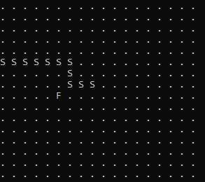
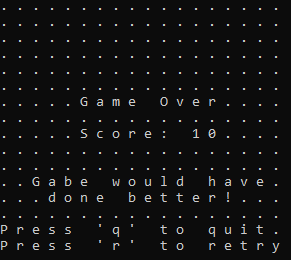

# Rust Snake

A colleague of mine dared me to create a game of snake in Rust before the weekend, so here is that project.
He didn't say what tools I had to use, so I ended up making a bare minimum CLI application.

## To Test:
* Install Rust and Cargo using the instructions outlined [here](https://doc.rust-lang.org/cargo/getting-started/installation.html).
* Run the application using the command:
```sh
cargo run
```

## To Build:
```sh
cargo build --release
```
You'll find the **snake.exe** executable in **target/release/**



